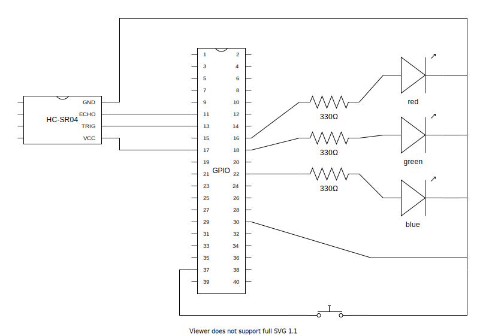

# sgbotic-dart

Dart counterpart to [SGBotic_Pi_3_Kit](https://github.com/SGBotic/SGBotic_Pi_3_Kit).

The following labs are converted:

File | Description
-|-
lib/rpi_lab1.dart | Sends output to blink a LED. Reads input from a push button.
lib/rpi_lab2.dart | Sends a PWM signal to a LED. Varies the period and duty cycle of the PWM.
lib/rpi_lab4.dart | Uses a HC-SR04 ultrasonic sensor.

The following connections are used:

The programs are tested on a Raspberry Pi 3 Model B, on Ubuntu LTS 20.04 64-bit (ARMv8). Dart with the Visual Studio Code extensions: Dart and "Remote - SSH", works fine on this setup.

Install some necessary packages on Ubuntu: `sudo apt install build-essential libgpiod-dev`

The rpi_gpio package requires a small hack to build the native library on Ubuntu:
- Run `pub global activate rpi_gpio`
- Open the file ~/.pub-cache/hosted/pub.dartlang.org/rpi_gpio-0.5.0/bin/build_lib.dart.
- Look for the check for "/home/pi" and change it to "/home/ubuntu".
- Run `pub global run rpi_gpio:build_lib`
